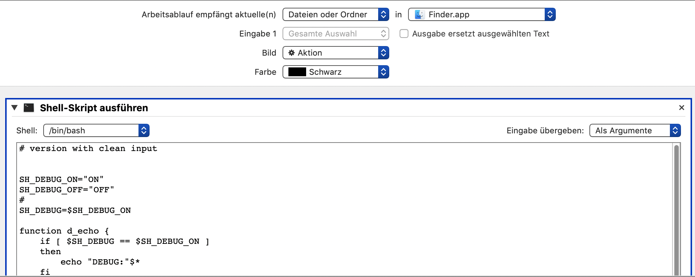

# CreateSymLink

The Mac Finder-Menu supports creating Mac-Aliases, Create SymLink makes an unix links: "Name.link"

CreateSymLink handles spaces or pecial characters

CreateSymLink works also with write-protected directories - the link will be created in Users Desktop-Folder

## Example: 

Input

	'´`" $ % &!"a  file name "!$.txt

Output

	 '´`" $ % &!"a  file name "!$.txt.link

## Install

Download CreateSymLink.worflow and copy the file to 

	~/Library/Services

Or install source CreateSymLink.sh with Automator
 {:width="36px"}